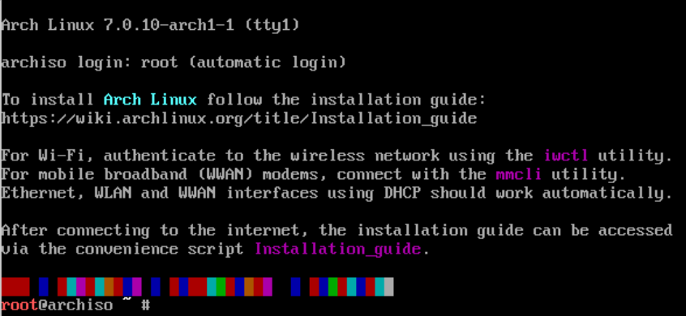
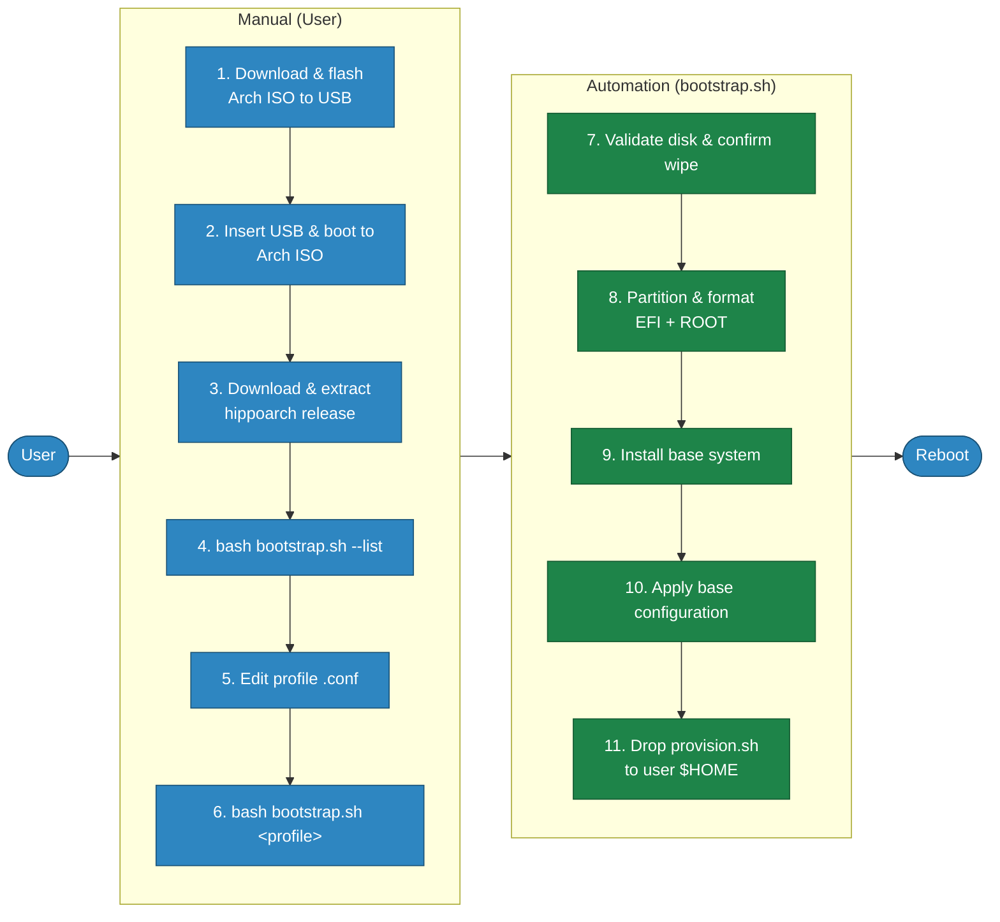
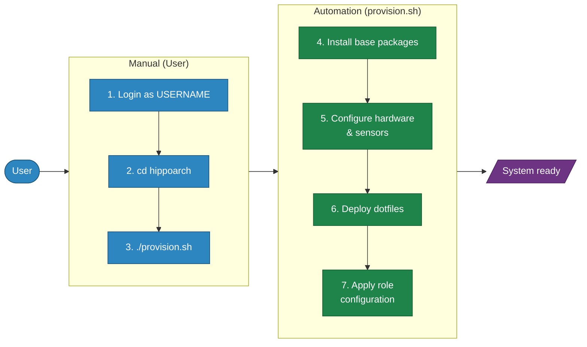

# HippoArch

[](https://github.com/hipponix/hippoarch/actions/workflows/ci.yml)
[](https://github.com/hipponix/hippoarch/releases/latest)

HippoArch automates Arch Linux installation and post-install provisioning in two phases — bootstrap from the live ISO, then provision after reboot — with no dependencies beyond bash and standard Arch tools.

I built it out of necessity: I kept repeating the same setup steps every time I configured a new machine. After my last manual installation, I finally decided to sort through a growing pile of local notes and automate the whole thing properly. Rather than reaching for Ansible or any other configuration management tool, I took it as a good excuse to go deeper into Linux and bash basics — keeping things simple, modular, and easy to evolve without extra layers or overhead.

It was never a clean one-shot implementation though. It grew incrementally, one issue at a time, each one found the hard way — including more than a few nights watching it fail silently.

Sharing it here in case it's useful to anyone running a similar Arch setup. Built around my needs — it may not work for many others.

## Table of contents

- [Process](#process)
- [Installation guide](#installation-guide)
- [Workflow](#workflow)
- [Profiles](#profiles)
- [Directory structure](#directory-structure)
- [Development](#development)
- [Contributing](#contributing)
- [References](#references)

## Process

### Phase 1 — Bootstrap (Live ISO)

Flash a USB with the [Arch Linux ISO](https://archlinux.org/download/) and boot from it. Download and extract the HippoArch release, then run `bootstrap.sh` with a profile. It partitions the disk, installs the base system, and drops `provision.sh` into the new user's home — ready for Phase 2.

> Pick one of the existing profiles or create your own — see the [Profiles](#profiles) section.


### Phase 2 — Provisioning (post-reboot)

Reboot into the freshly installed system and run `provision.sh`. It installs packages, configures hardware and sensors, deploys dotfiles, and applies the role-specific setup defined in the profile.


## Installation guide

### Phase 1 — Bootstrap (Live ISO)

1. Download the [Arch Linux ISO](https://archlinux.org/download/) and flash it to a USB drive.

   With [Balena Etcher](https://etcher.balena.io) (GUI), or with `dd`:
   ```bash
   dd if=archlinux-x86_64.iso of=/dev/sdX bs=4M status=progress && sync
   ```

2. Insert the USB, power on the device, and wait for the Arch Linux login prompt.

   

3. Download and extract the latest HippoArch release.
   ```bash
   curl -LO https://github.com/hipponix/hippoarch/releases/latest/download/hippoarch.tar.gz
   tar xzf hippoarch.tar.gz && cd hippoarch
   ```
4. List available profiles to pick the right one for your hardware.
   ```bash
   bash bootstrap.sh --list
   ```
5. Open the `.conf` file and set `DISK`, `HOSTNAME`, `USERNAME`, `ROOT_PASSWORD`, `USER_PASSWORD`, `TIMEZONE`, `LOCALE`, and `LAYOUT`. The script aborts if passwords are left as `changeme`.
   ```bash
   vim profiles/workstation.conf
   ```
6. Run the bootstrap with your chosen profile.
   ```bash
   bash bootstrap.sh profiles/workstation.conf
   ```

*The following steps are performed automatically by `bootstrap.sh`:*

7. Check that `DISK` is a valid block device and require explicit `yes` confirmation before any write.
8. Create a GPT table with a 512 MB EFI partition and a root partition, and format them as FAT32 and ext4 or btrfs respectively.
9. Install the base Arch packages into `/mnt`.
10. Enter the new system and apply the base configuration.
11. Place `provision.sh` in the user `$HOME` directory, ready to run after reboot.
12. Prompt to reboot — remove the USB stick when asked, then press `y`.

### Phase 2 — Provisioning (post-reboot)

1. Log in to the machine as USERNAME after reboot.
2. Navigate to the hippoarch directory.
   ```bash
   cd hippoarch
   ```
3. Run `provision.sh` — it reads `ROLE` from `/etc/hippoarch.conf`, written during bootstrap.
   ```bash
   ./provision.sh
   ```

*The following steps are performed automatically by `provision.sh`:*

4. Install the base packages defined in `common/base.sh`.
5. Copy dotfiles (`.vimrc`, `.bash_aliases`) to the user home directory.
6. Run `roles/<role>/install.sh` to apply role-specific packages and configuration.

## Workflow

### Phase 1 — Bootstrap (Live ISO)



### Phase 2 — Provisioning (post-reboot)



> **Legend:** blue = user action &nbsp;·&nbsp; green = automated by script &nbsp;·&nbsp; purple = final state

## Profiles

A profile is a `.conf` file sourced into `bootstrap.sh`. Required fields:

| Variable | Example | Notes |
|---|---|---|
| `DISK` | `/dev/nvme0n1` | Must be a block device |
| `HOSTNAME` | `arch-server` | |
| `USERNAME` | `user` | Wheel group member |
| `ROOT_PASSWORD` | — | Set in profile, never hardcoded |
| `USER_PASSWORD` | — | Same |
| `TIMEZONE` | `Europe/Rome` | |
| `LOCALE` | `en_US.UTF-8` | |
| `LAYOUT` | `simple` or `btrfs` | |
| `ROLE` | — | Derived from profile filename; override only if needed |
| `EXTRA_PACKAGES` | `"openssh htop"` | Space-separated, optional |

## Directory structure

```text
hippoarch/
├── bootstrap.sh            # Phase 1: run from Live ISO
├── provision.sh            # Phase 2: run after first reboot
├── profiles/               # Machine-specific .conf files
├── lib/
│   └── partition.sh        # layout_simple / layout_btrfs
├── common/
│   ├── base.sh             # Packages, sensors, dotfiles — all machines
│   └── dotfiles/           # .vimrc, .bash_aliases
├── roles/
│   ├── server-cwwk/install.sh
│   ├── server-k8s-master/install.sh
│   ├── server-k8s-node/install.sh
│   ├── workstation/install.sh
│   └── qemu-test/install.sh
├── docs/
│   ├── user-manual.md      # Full installation and usage guide
│   └── testing.md          # Testing strategy and developer guide
└── tests/
    ├── helpers.bash
    ├── mocks/              # Mock scripts for unit tests
    ├── test_*.bats         # Unit tests (bats, mocked)
    ├── functional/         # Functional tests (real loopback devices)
    └── integration/run.sh  # QEMU end-to-end test
```

## Development

### Bootstrap reference

| Option | Description |
|--------|-------------|
| `--version` | Print the current HippoArch version |
| `--detect` | Show CPU, disk, and RAM info for the current machine |
| `--list` | List available profiles from the GitHub repo |
| `--fetch-all` | Download all profiles and `lib/partition.sh` locally |
| `--fetch <profile>` | Download a single profile and `lib/partition.sh` without running |
| `<profile>` | Run the full bootstrap using the given profile |

### Setup

```bash
make install-deps   # shellcheck + docker + qemu + git hook wired to hooks/pre-push
```

### Quality assurance

```bash
make lint                         # shellcheck on all scripts
make security                     # grep for sensitive patterns
make test-syntax                  # bash -n on all scripts
make test-unit                    # unit tests (bats + mocks, docker)
make test-functional              # functional tests (real loopback, privileged docker)
make test                         # unit + functional
make test-integration             # QEMU end-to-end (opens window)
make HEADLESS=1 test-integration  # headless
```

The pre-push hook (`hooks/pre-push`) runs `make lint`, `make security`, and `make test-syntax` automatically. Wire it once with `make install-deps`.

The integration test (`make test-integration`) spins up a real QEMU virtual machine and runs the full two-phase installation — bootstrap from a live Arch ISO, reboot into the installed system, provision — verifying the result end-to-end. The same test runs headless on the CI pipeline on every push, so every change is validated against a real Arch install, not a mock.

See [docs/testing.md](docs/testing.md) for the full testing strategy.

### Release

```bash
make release   # auto-increments patch version, tags, and pushes — triggers the CI release pipeline
```

Run from `main` after merging all changes. The version is derived automatically from the latest git tag (`v0.1.1 → v0.1.2`). For a minor or major bump, edit `VERSION` manually before running. The pipeline builds the tarball and publishes a GitHub release.

## Contributing

Issues and pull requests are welcome. If you're adding a new profile or role, make sure `make test` passes locally before opening a PR. For anything non-trivial, open an issue first so we can discuss the approach.

## References

- [Arch Wiki: Installation guide](https://wiki.archlinux.org/title/Installation_guide)
- [Arch Wiki: Lm_sensors](https://wiki.archlinux.org/title/Lm_sensors)
- [CWWK Motherboard Specs](https://cwwkpc.com/products/cwwk/nas-motherboard-8-bay-core-i5-8265u-4c-8t-mini-itx-pc-mainboard-white-m11-2-x-nvme-pcie3-0-x2-dual-2-5gbe-i226v-lan-ddr4-16gb-ram-128gb-ssd-pcie-x4-slot-tf-hd-dp)
