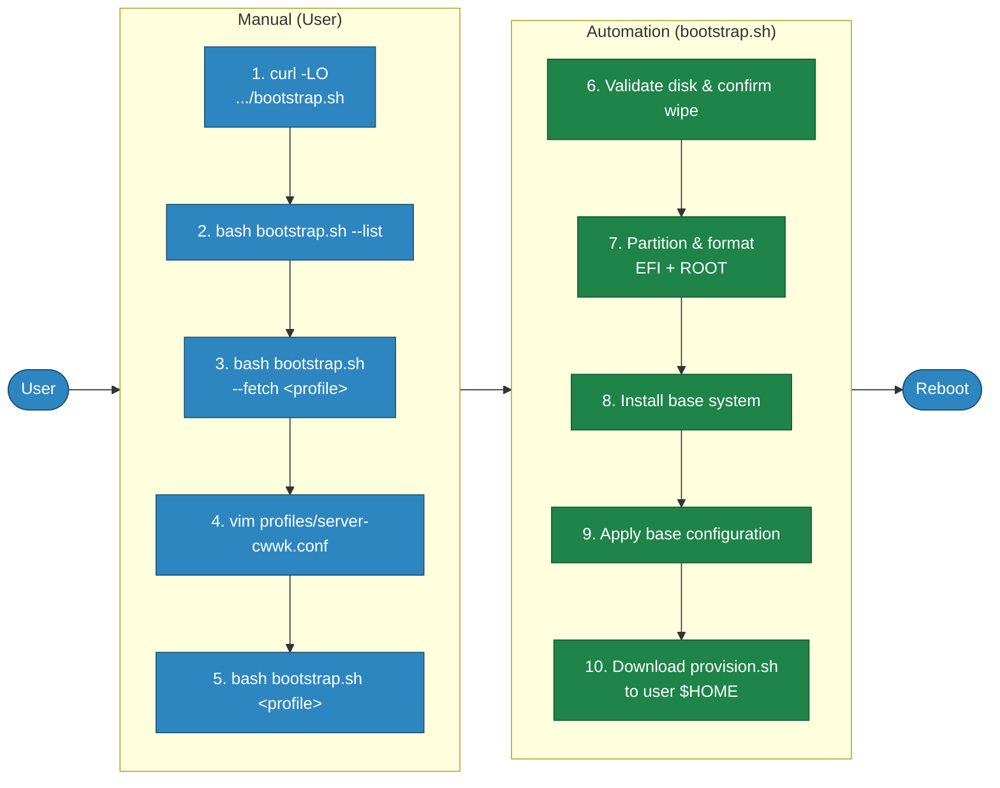

# HippoArch

These are my personal notes and scripts for configuring my local Arch Linux workstations and servers.

I built this because I found myself repeating the same installation and configuration steps over and over — especially when setting up new hardware like my CWWK 8-bay motherboard. I wanted a way to automate the process without the complexity and extra layers of Ansible or other heavy configuration management frameworks.

I'm sharing these notes here in the hope that they might be helpful to anyone else looking for a simple, zero-dependency way to manage their Arch fleet.

## Directory structure

```text
hippoarch/
├── bootstrap.sh            # Phase 1: run from Live ISO
├── provision.sh            # Phase 2: run after first reboot
├── profiles/               # Machine-specific .conf files
├── lib/
│   └── partition.sh        # layout_simple / layout_btrfs
├── common/
│   ├── base.sh             # Packages, sensors, dotfiles — all machines
│   └── dotfiles/           # .vimrc, .bash_aliases
├── roles/
│   ├── server-cwwk/install.sh
│   ├── server-k8s-master/install.sh
│   ├── server-k8s-node/install.sh
│   └── workstation/install.sh
├── docs/
│   ├── user-manual.md      # Full installation and usage guide
│   └── testing.md          # Testing strategy and developer guide
└── tests/
    ├── helpers.bash
    ├── mocks/              # Mock scripts for unit tests
    ├── test_*.bats         # Unit tests (bats, mocked)
    ├── functional/         # Functional tests (real loopback devices)
    └── integration/run.sh  # QEMU end-to-end test
```

## Installation

### Phase 1 — Bootstrap (Live ISO)



*Manual (User):*

1. Download the bootstrap script from the GitHub repo.
   ```bash
   curl -LO https://raw.githubusercontent.com/hipponix/hippoarch/main/bootstrap.sh
   ```
2. Print all available profiles to pick the right one for your hardware.
   ```bash
   bash bootstrap.sh --list
   ```
3. Download the selected profile and `lib/partition.sh` locally without running anything.
   ```bash
   bash bootstrap.sh --fetch profiles/server-cwwk.conf
   ```
4. Open the `.conf` file and set `DISK`, `HOSTNAME`, `USERNAME`, `ROOT_PASSWORD`, `USER_PASSWORD`, `TIMEZONE`, `LOCALE`, and `LAYOUT`. The script aborts if passwords are left as `changeme`.
   ```bash
   vim profiles/server-cwwk.conf
   ```
5. Source the profile and start the automated installation.
   ```bash
   bash bootstrap.sh profiles/server-cwwk.conf
   ```

*Automation (bootstrap.sh):*

6. Check that `DISK` is a valid block device and require explicit `yes` confirmation before any write.
7. Create a GPT table with a 512 MB EFI partition and a root partition, and format them as FAT32 and ext4 or btrfs respectively.
8. Install the base Arch packages into `/mnt`.
9. Enter the new system and apply the base configuration.
10. Download `provision.sh` to the user `$HOME` directory, ready to run after reboot.

### Bootstrap options reference

| Option | Description |
|--------|-------------|
| `--version` | Print the current HippoArch version |
| `--detect` | Show CPU, disk, and RAM info for the current machine |
| `--list` | List available profiles from the GitHub repo |
| `--fetch-all` | Download all profiles and `lib/partition.sh` locally |
| `--fetch <profile>` | Download a single profile and `lib/partition.sh` without running |
| `<profile>` | Run the full bootstrap using the given profile |

### Phase 2 — Provisioning (post-reboot)


> **Legend:** blue = user action &nbsp;·&nbsp; green = automated by script &nbsp;·&nbsp; purple = final state

*Manual (User):*

1. Login to the machine as USERNAME after reboot.
2. Navigate to the hippoarch directory.
   ```bash
   cd hippoarch
   ```
3. Run `provision.sh` — it reads `ROLE` from `/etc/hippoarch.conf`, written during bootstrap.
   ```bash
   ./provision.sh
   ```

*Automation (provision.sh):*

4. Install the base packages defined in `common/base.sh`.
5. Load the IT87 hardware driver and enable sensor monitoring via `lm_sensors`.
6. Copy dotfiles (`.vimrc`, `.bash_aliases`) to the user home directory.
7. Run `roles/<role>/install.sh` to apply role-specific packages and configuration.

## Profiles

A profile is a `.conf` file sourced into `bootstrap.sh`. Required fields:

| Variable | Example | Notes |
|---|---|---|
| `DISK` | `/dev/nvme0n1` | Must be a block device |
| `HOSTNAME` | `arch-server` | |
| `USERNAME` | `user` | Wheel group member |
| `ROOT_PASSWORD` | — | Set in profile, never hardcoded |
| `USER_PASSWORD` | — | Same |
| `TIMEZONE` | `Europe/Rome` | |
| `LOCALE` | `en_US.UTF-8` | |
| `LAYOUT` | `simple` or `btrfs` | |
| `ROLE` | `server-cwwk` | Written to `/etc/hippoarch.conf` |
| `EXTRA_PACKAGES` | `"openssh htop"` | Space-separated, optional |

## Quality assurance

```bash
make install-deps   # shellcheck + docker + qemu + git hook wired to hooks/pre-push
make lint           # shellcheck on all scripts
make security       # grep for sensitive patterns
make test-syntax    # bash -n on all scripts
make test-unit         # unit tests (bats + mocks, docker)
make test-functional   # functional tests (real loopback, privileged docker)
make test              # unit + functional
make test-integration          # QEMU end-to-end (opens window)
make HEADLESS=1 test-integration  # headless
```

The pre-push hook (`hooks/pre-push`) runs `make lint`, `make security`, and `make test-syntax` automatically. Wire it once with `make install-deps`.

See [docs/testing.md](docs/testing.md) for the full testing strategy, and [docs/user-manual.md](docs/user-manual.md) for detailed installation instructions.

## References

- [Arch Wiki: Installation guide](https://wiki.archlinux.org/title/Installation_guide)
- [Arch Wiki: Lm_sensors](https://wiki.archlinux.org/title/Lm_sensors)
- [CWWK Motherboard Specs](https://cwwkpc.com/products/cwwk-nas-motherboard-8-bay-core-i5-8265u-4c-8t-mini-itx-pc-mainboard-white-m11-2-x-nvme-pcie3-0-x2-dual-2-5gbe-i226v-lan-ddr4-16gb-ram-128gb-ssd-pcie-x4-slot-tf-hd-dp)
