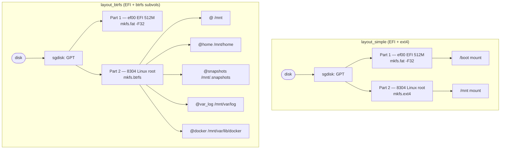
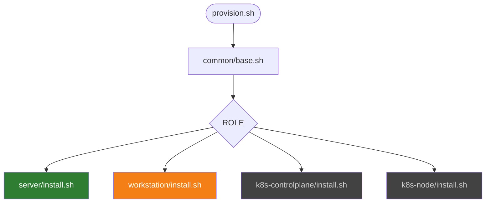
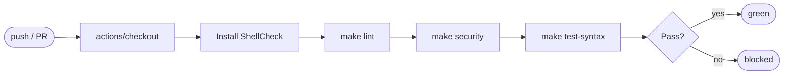

# HippoArch

Personal automation toolkit for Arch Linux installs on my bare-metal hardware — primarily a CWWK 8-bay NAS/server board. No Ansible, no complex state management — just shell scripts with a clear two-phase model and a profile per machine.

## How it works

```mermaid
flowchart LR
    subgraph Phase1["Phase 1 — Live ISO"]
        A([Boot ISO]) --> B[bootstrap.sh]
        B --> C{Layout?}
        C -- simple --> D[EFI + ext4]
        C -- btrfs  --> E[EFI + btrfs subvols]
        D & E --> F[pacstrap]
        F --> G[arch-chroot config]
        G --> H[/mnt/etc/hippoarch.conf]
    end
    subgraph Phase2["Phase 2 — Installed system"]
        I([Reboot]) --> J[provision.sh]
        J --> K[common/base.sh]
        K --> L{Role?}
        L -- server      --> M[roles/server/install.sh]
        L -- workstation --> N[roles/workstation/install.sh]
        L -- k8s-*       --> O[roles/k8s-*/install.sh]
        M & N & O --> P([Done])
    end
    H --> I
```

## Directory structure

```text
hippoarch/
├── bootstrap.sh            # Phase 1: run from Live ISO
├── provision.sh            # Phase 2: run after first reboot
├── profiles/               # Machine-specific .conf files
├── lib/
│   └── partition.sh        # layout_simple / layout_btrfs
├── common/
│   ├── base.sh             # Packages, sensors, dotfiles — all machines
│   └── dotfiles/           # .vimrc, .bash_aliases
├── roles/
│   ├── server/install.sh
│   ├── workstation/install.sh
│   ├── k8s-controlplane/install.sh
│   └── k8s-node/install.sh
└── tests/
    ├── helpers.bash
    ├── mocks/              # 18 mock scripts (log calls, exit 0)
    ├── test_*.bats         # bats unit tests
    └── integration/run.sh  # QEMU end-to-end test
```

## Partition layouts



## Profile lifecycle

```mermaid
flowchart LR
    A([profiles/*.conf]) -- "source \$PROFILE" --> B[bootstrap.sh]
    B -- "chattr +i" --> C[/etc/hippoarch.conf]
    C -- "source" --> D[provision.sh]
    D -- "chattr -i → sed → chattr +i" --> C
    C -- inspect --> E([audit / re-provision])
```

## Role dependency tree



## CI pipeline



## Installation

### Phase 1 — Bootstrap (Live ISO)

```bash
curl -LO https://raw.githubusercontent.com/hipponix/hippoarch/main/bootstrap.sh

# Optional helpers (no install triggered)
bash bootstrap.sh --detect          # show CPU / disk / RAM
bash bootstrap.sh --list            # list profiles in the repo
bash bootstrap.sh --fetch server-cwwk.conf

# Full install
bash bootstrap.sh profiles/server-cwwk.conf
```

The script validates the disk is a block device and requires you to type `yes` before touching it.

### Phase 2 — Provisioning (post-reboot)

```bash
cd hippoarch
./provision.sh          # reads ROLE from /etc/hippoarch.conf
./provision.sh server   # or override via CLI
```

## Profiles

A profile is a `.conf` file sourced into `bootstrap.sh`. Required fields:

| Variable | Example | Notes |
|---|---|---|
| `DISK` | `/dev/nvme0n1` | Must be a block device |
| `HOSTNAME` | `arch-server` | |
| `USERNAME` | `user` | Wheel group member |
| `ROOT_PASSWORD` | — | Set in profile, never hardcoded |
| `USER_PASSWORD` | — | Same |
| `TIMEZONE` | `Europe/Rome` | |
| `LOCALE` | `en_US.UTF-8` | |
| `LAYOUT` | `simple` or `btrfs` | |
| `ROLE` | `server` | Written to `/etc/hippoarch.conf` |
| `EXTRA_PACKAGES` | `"openssh htop"` | Space-separated, optional |

## Quality assurance

```bash
make install-deps   # shellcheck + docker + qemu + git hook wired to hooks/pre-push
make lint           # shellcheck on all scripts
make security       # grep for sensitive patterns
make test-syntax    # bash -n on all scripts
make test           # bats unit tests via docker
make test-integration          # QEMU end-to-end (opens window)
make HEADLESS=1 test-integration  # headless
```

The pre-push hook (`hooks/pre-push`) runs `make lint`, `make security`, and `make test-syntax` automatically. Wire it once with `make install-deps`.

## References

- [Arch Wiki: Installation guide](https://wiki.archlinux.org/title/Installation_guide)
- [Arch Wiki: Lm_sensors](https://wiki.archlinux.org/title/Lm_sensors)
- [CWWK Motherboard Specs](https://cwwkpc.com/products/cwwk-nas-motherboard-8-bay-core-i5-8265u-4c-8t-mini-itx-pc-mainboard-white-m11-2-x-nvme-pcie3-0-x2-dual-2-5gbe-i226v-lan-ddr4-16gb-ram-128gb-ssd-pcie-x4-slot-tf-hd-dp)
